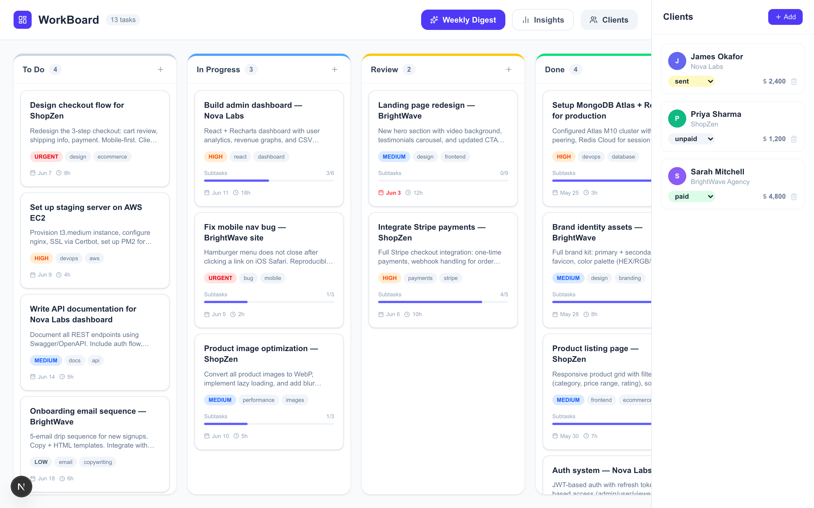
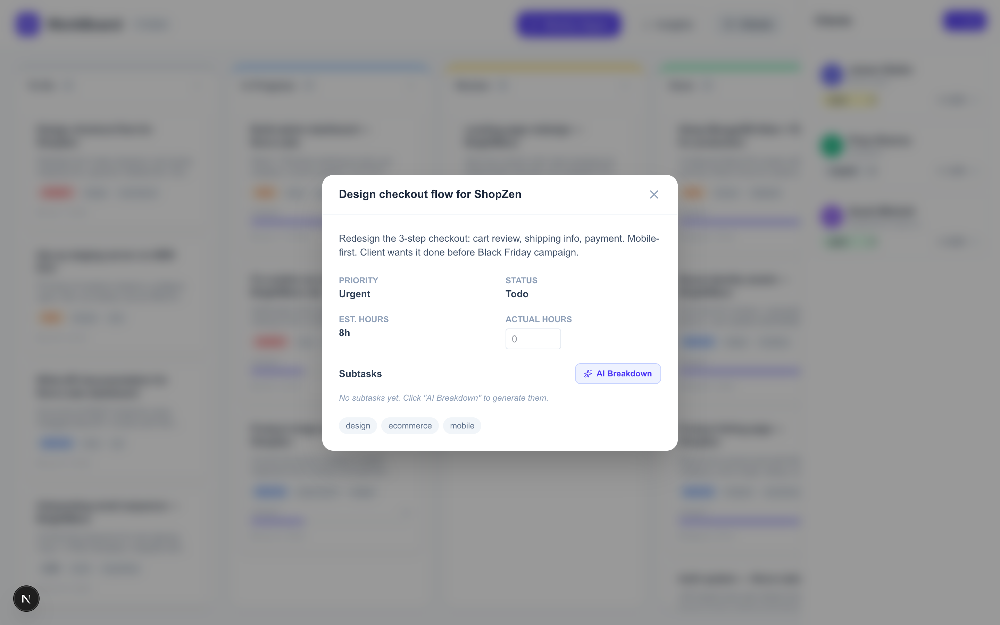
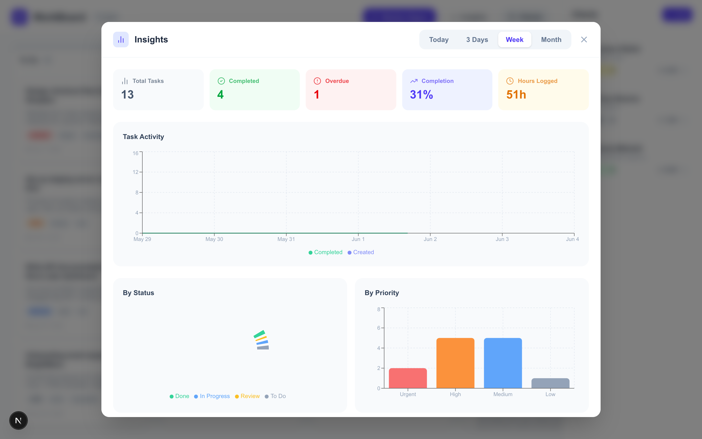
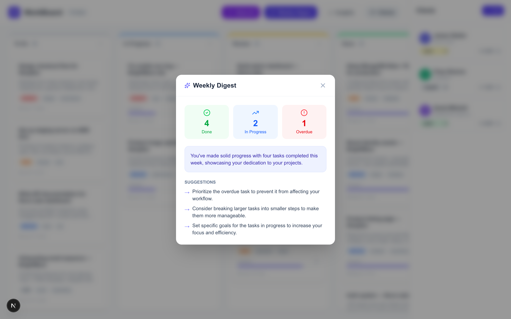
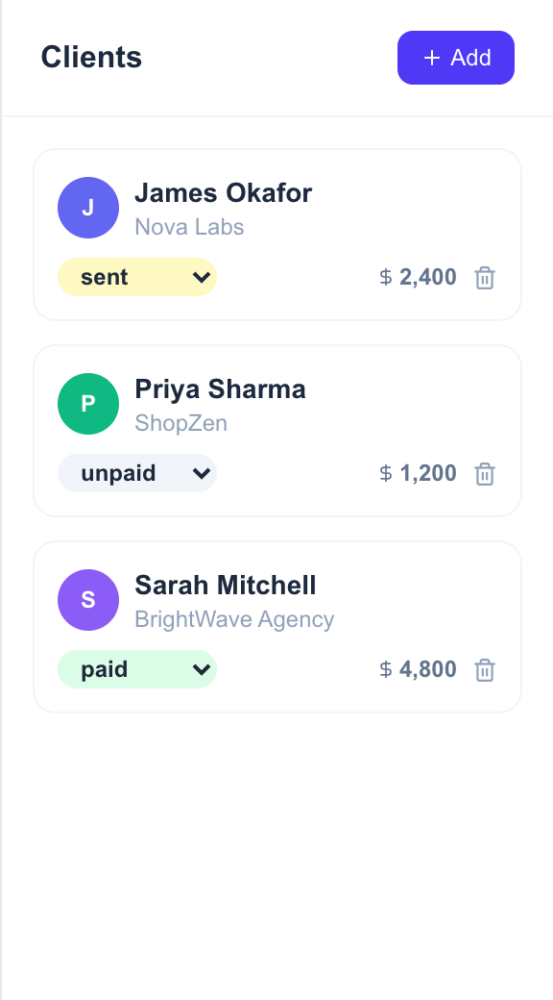

# WorkBoard

   — AI-Powered Kanban for Freelancers

> A production-ready Kanban board built for freelancers who manage multiple clients. Unlike every other AI Kanban tool (which manages AI coding agents), WorkBoard helps **you** manage your own work — with AI as your assistant.



---

## Why WorkBoard?

Every existing AI Kanban on GitHub is built for orchestrating AI coding agents (Claude Code, Codex, Gemini CLI). **None of them are built for freelancers managing real client work.**

WorkBoard fills that gap:
- Track tasks across clients in one board
- Let AI estimate how long tasks take
- Let AI break complex tasks into subtasks
- Get a weekly AI-generated digest of your productivity
- Visualize your progress with real charts

---

## Features

### Kanban Board — Drag & Drop
4 columns: **To Do → In Progress → Review → Done**. Drag tasks between columns. Real-time sync via Socket.IO — multiple people can view the same board simultaneously.


---

### AI Task Breakdown
Open any task and click **AI Breakdown**. GPT-4o-mini splits your vague task into specific, actionable subtasks with checkboxes. A progress bar on the card tracks completion.



---

### Add Task with AI Time Estimate
When creating a task, click the ✨ button next to **Est. Hours**. AI reads your task title and description and returns an estimate with confidence level and reasoning.


---

### Insights Dashboard
Click **Insights** in the header. Switch between **Today / 3 Days / Week / Month** to see:
- Task activity chart (created vs completed per day)
- Status breakdown donut chart
- Priority breakdown bar chart
- Estimated vs actual hours per task



---

### Weekly AI Digest
Click **Weekly Digest** — AI reads all your tasks and returns a motivating summary with stats and 3 actionable suggestions for your week.



---

### Client Management
Track clients with invoice status (unpaid → sent → paid → overdue) and total earnings. Each task is linked to a client and color-coded on the board.



---

## Tech Stack

| Layer | Technology |
|---|---|
| Frontend | Next.js 14 (App Router), React, Tailwind CSS |
| Real-time | Socket.IO |
| Backend | Node.js, Express (custom server) |
| Database | MongoDB + Mongoose |
| Cache | Redis |
| AI | OpenAI GPT-4o-mini |
| Charts | Recharts |
| Drag & Drop | @hello-pangea/dnd |

---

## What Makes This Different

| Feature | WorkBoard | Trello | Flowise | ai-agent-board |
|---|---|---|---|---|
| For human freelancers | ✅ | ✅ | ❌ | ❌ |
| AI task breakdown | ✅ | ❌ | ❌ | ❌ |
| AI time estimation | ✅ | ❌ | ❌ | ❌ |
| Client + invoice tracking | ✅ | ❌ | ❌ | ❌ |
| Weekly AI digest | ✅ | ❌ | ❌ | ❌ |
| Progress analytics | ✅ | ❌ | ❌ | ❌ |
| Real-time multi-user | ✅ | ✅ | ❌ | ❌ |
| Self-hosted + open source | ✅ | ❌ | ✅ | ✅ |

---

## Getting Started

### Prerequisites
- Node.js 18+
- MongoDB (local or Atlas)
- Redis
- OpenAI API key

### Installation

```bash
# Clone the repo
git clone https://github.com/yourusername/workboard
cd workboard

# Install dependencies
npm install

# Copy env file
cp .env.local.example .env.local
# → Add your OPENAI_API_KEY to .env.local

# Start MongoDB and Redis (macOS)
brew services start mongodb/brew/mongodb-community
brew services start redis

# Seed with demo data
npx ts-node --project tsconfig.server.json seed.ts

# Start the app
npm run dev
```

Open [http://localhost:3000](http://localhost:3000)

---

## Environment Variables

```env
MONGODB_URI=mongodb://localhost:27017/workboard
REDIS_URL=redis://localhost:6379
OPENAI_API_KEY=your_openai_api_key
NEXT_PUBLIC_SOCKET_URL=http://localhost:3000
PORT=3000
```

---

## Project Structure

```
workboard/
├── server.ts                   # Custom Next.js + Socket.IO server
├── seed.ts                     # Demo data seeder
├── src/
│   ├── app/
│   │   ├── api/
│   │   │   ├── tasks/          # CRUD for tasks
│   │   │   ├── clients/        # CRUD for clients
│   │   │   ├── insights/       # Analytics aggregation
│   │   │   └── ai/
│   │   │       ├── breakdown/  # AI subtask generation
│   │   │       ├── estimate/   # AI time estimation
│   │   │       └── digest/     # AI weekly digest
│   ├── components/
│   │   ├── Board.tsx           # Main board layout
│   │   ├── TaskCard.tsx        # Kanban card
│   │   ├── AddTaskModal.tsx    # Create task + AI estimate
│   │   ├── TaskDetailModal.tsx # Task detail + AI breakdown
│   │   ├── ClientPanel.tsx     # Client management sidebar
│   │   ├── AIDigest.tsx        # Weekly digest modal
│   │   └── InsightsModal.tsx   # Analytics charts
│   ├── models/
│   │   ├── Task.ts
│   │   └── Client.ts
│   └── hooks/
│       └── useSocket.ts        # Socket.IO client hook
```

---

## Built by

Muhammad Adil — [GitHub](https://github.com/yourusername) · [LinkedIn](https://linkedin.com/in/yourusername) · [Portfolio](https://yourportfolio.com)

---

## Original Next.js Notes

First, run the development server:

```bash
npm run dev
# or
yarn dev
# or
pnpm dev
# or
bun dev
```

Open [http://localhost:3000](http://localhost:3000) with your browser to see the result.

You can start editing the page by modifying `app/page.tsx`. The page auto-updates as you edit the file.

This project uses [`next/font`](https://nextjs.org/docs/app/building-your-application/optimizing/fonts) to automatically optimize and load [Geist](https://vercel.com/font), a new font family for Vercel.

## Learn More

To learn more about Next.js, take a look at the following resources:

- [Next.js Documentation](https://nextjs.org/docs) - learn about Next.js features and API.
- [Learn Next.js](https://nextjs.org/learn) - an interactive Next.js tutorial.

You can check out [the Next.js GitHub repository](https://github.com/vercel/next.js) - your feedback and contributions are welcome!

## Deploy on Vercel

The easiest way to deploy your Next.js app is to use the [Vercel Platform](https://vercel.com/new?utm_medium=default-template&filter=next.js&utm_source=create-next-app&utm_campaign=create-next-app-readme) from the creators of Next.js.

Check out our [Next.js deployment documentation](https://nextjs.org/docs/app/building-your-application/deploying) for more details.
